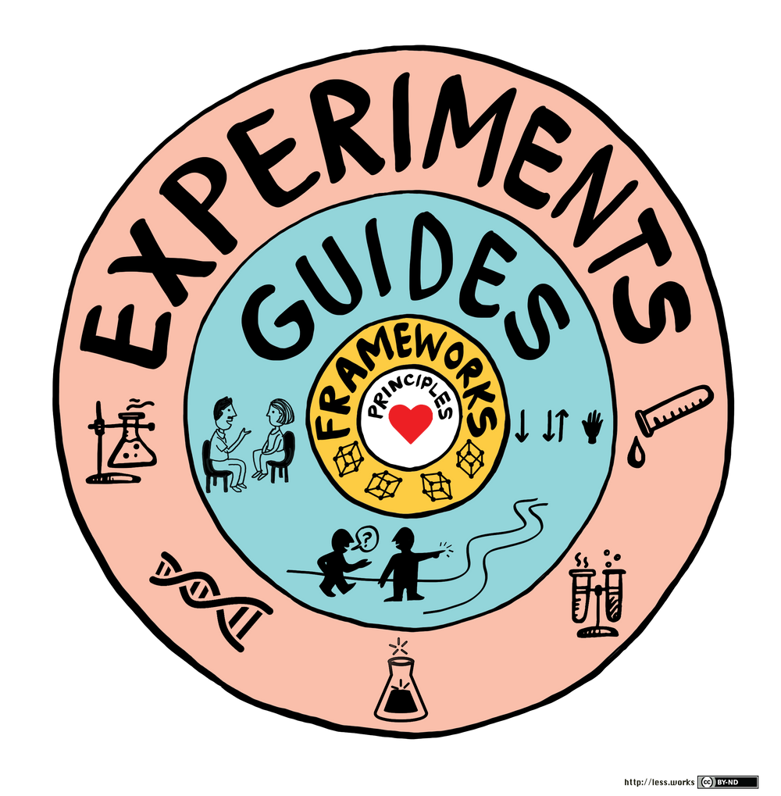

# Large-Scale Scrum

Масштабування Scrum починається з розуміння стандартного однокомандного Scrum. З цього моменту ваша організація повинна бути в змозі зрозуміти і прийняти LeSS, що вимагає вивчення мети елементів однокомандного Scrum і з'ясування того, як досягти тієї ж мети, залишаючись в рамках обмежень стандартних правил Scrum.

Гнучка розробка за допомогою Scrum вимагає глибоких організаційних змін, щоб стати гнучкою. Тому ні Scrum, ні LeSS не слід розглядати як просто практику. Скоріше, вони формують фреймворк організаційного дизайну.

<figure><figcaption></figcaption></figure>

LeSS це різновид Agile розробки програмного забезпечення, за масштабом схожий на [Scaled Agile Framework® (SAF)](scaled-agile-framework.md)

### Два фреймворки гнучкого масштабування 

LeSS пропонує два різних масштабних фреймворки Scrum. Більшість елементів масштабування LeSS зосереджені на тому, щоб спрямувати увагу всіх команд на весь продукт, а не на "мою частину".

Глобальний та "наскрізний" фокус є, мабуть, домінуючими проблемами, які потрібно вирішити при масштабуванні. Два фреймворки, які, по суті, є масштабованим Scrum для однієї команди, є такими:

* **LeSS:** до восьми команд (по вісім осіб у кожній).
* **LeSS Huge:** До кількох тисяч людей на одному продукті.

**Що означає бути таким же, як One-Team Scrum?**

**LeSS** - це розширена версія однокомандного Scrum, яка підтримує багато практик та ідей однокомандного Scrum.

**У LeSS ви знайдете:**

* єдиний Product Backlog (тому що він для продукту, а не для команди)
* єдине Визначення Готового для всіх команд,
* один потенційно можливий до відвантаження інкремент продукту в кінці кожного спринту,
* один власник продукту,
* багато повноцінних, крос-функціональних команд (без вузькоспеціалізованих команд),
* один Спринт.

У LeSS всі команди беруть участь у спільному спринті, щоб створити спільний продукт, який можна відвантажити, кожного спринту.

### Що відрізняється в LeSS? 

* **Планування спринту, частина 1 (Sprint Planning Part 1):** Окрім одного власника продукту, до нього входять люди з усіх команд. Дозвольте членам команди самостійно вирішити, як вони розподілятимуть відкладені позиції продукту. Члени команди також обговорюють можливості знайти спільну роботу і співпрацювати, особливо для пов'язаних елементів.
* **Планування спринту, частина 2 (Sprint Planning Part 2):** Ця частина проводиться незалежно (і зазвичай паралельно) кожною командою, хоча іноді для простої координації та навчання дві або більше команд можуть проводити її в одному приміщенні (в різних зонах).
* **Щоденний скрам (Daily Scrum):** Також проводиться незалежно кожною командою, хоча член команди А може спостерігати за щоденним скрамом команди Б, щоб покращити обмін інформацією.
* **Координація (Coordination):** Просто розмова, спілкування в коді, мандрівники, відкритий простір та спільноти.
* **Загальний PBR (Overall PBR):** Може проводитися необов'язкова і коротка загальна зустріч з уточнення відставання продукту (**Product Backlog Refinement, PBR**), яка включає одного Власника продукту і людей з усіх команд. Основна мета полягає в тому, щоб вирішити, які команди, ймовірно, будуть реалізовувати які пункти, і, відповідно, вибрати ці пункти для подальшого поглибленого однокомандного PBR. Це також шанс підвищити узгодженість з Власником продукту і всіма командами.
* **Доопрацювання бэклогу продукту (Product Backlog Refinement):** Єдина вимога в LeSS - це однокомандний PBR, так само, як і в однокомандному Scrum. Але поширеною і корисною варіацією є багатокомандний PBR, коли дві або більше команд знаходяться в одній кімнаті разом, щоб покращити навчання та координацію.
* **Огляд спринту (Sprint Review):** На додаток до одного власника продукту, він включає людей з усіх команд, а також відповідних клієнтів/користувачів та інших зацікавлених сторін. Для етапу перевірки приросту продукту і нових елементів, розгляньте стиль "базару" або "наукового ярмарку": велика кімната з декількома зонами, кожна з яких укомплектована членами команди, де демонструються і обговорюються елементи, розроблені командами.
* **Загальна ретроспектива (Overall Retrospective):** Це нова зустріч, якої немає в однокомандному Scrum, і її мета - дослідити покращення загальної системи, а не зосереджуватися на одній команді. Максимальна тривалість - 45 хвилин на тиждень спринту. У ній беруть участь власник продукту, скрам-майстри та представники кожної команди, які змінюються на ротаційній основі.

### Введення в LeSS 

#### Однокомандний Scrum (One-Team Scrum) 

**Scrum** - це емпірична структура розробки, в якій міжфункціональна самокерована команда розробляє продукт в ітеративному інкрементному режимі. Кожен спринт, що триває певний проміжок часу, є потенційно готовим до відвантаження і, в ідеалі, відвантаженим продуктом.

Один власник продукту відповідає за максимізацію цінності продукту, визначення пріоритетів у продуктовому беклозі та адаптивне визначення мети кожного спринту на основі постійного зворотного зв'язку та навчання. Невелика команда відповідає за досягнення мети спринту; немає обмежень на вузькоспеціалізовані ролі.

**Скрам-майстер** пояснює, навіщо потрібен Скрам і як отримати з нього користь, навчає Власника продукту, команду та організацію застосовувати його, а також виступає в ролі дзеркала. Тут немає менеджера проекту або керівника команди.

Емпіричний контроль процесу вимагає прозорості, яка досягається завдяки короткому циклу розробки та аналізу етапів виробництва продукту, що відвантажується. Він наголошує на безперервному навчанні, перевірці та адаптації продукту і того, як він створюється.

Він базується на розумінні того, що в розробці все занадто складно і динамічно для детальних і шаблонних рецептів процесу, які перешкоджають питанням, залученню, вдосконаленню.

У Scrum Guide та Scrum Primer основна увага приділяється одній команді, а не багатьом командам, які працюють разом. І це природно призводить до роздумів про великомасштабний Scrum.

#### LeSS 

> **LeSS** - це Scrum, застосований до багатьох команд, що працюють разом над одним продуктом.

LeSS - це Scrum - Великий Скрам (LeSS) не є новим і вдосконаленим Скрамом. І це не Scrum в основі для кожної команди, а щось інше, що нашаровується зверху.

Це скоріше про те, як максимально просто застосувати принципи, мету, елементи та елегантність Scrum у великомасштабному контексті. Як і Scrum та інші справді гнучкі фреймворки, LeSS є "ледь достатньою методологією" з причин високої результативності.

**...застосовується до багатьох команд** - міжфункціональні, міжкомпонентні, повностекові функціональні команди з 3-9 людей, орієнтовані на навчання, які роблять все - від UX до коду та відео - для створення готових елементів та готового до відправки продукту.

**...працюють разом** - Команди працюють разом, тому що у них є спільна мета - випустити один спільний продукт в кінці спільного спринту, і кожна команда зацікавлена в цьому, тому що вони є функціональною командою, відповідальною за ціле, а не за окремі частини.

**...над одним продуктом** - Яким продуктом? Широке комплексне наскрізне клієнтоорієнтоване рішення, яким користуються реальні клієнти. Це не компонент, платформа, шар чи бібліотека.

#### Передісторія (Background) 

У 2002 році, коли Крейг написав книгу "Agile & Iterative Development", багато хто вважав, що гнучка розробка призначена лише для невеликих груп. Однак  Крейг і Бас зацікавилися - і отримали все більше запитів - застосуванням Скраму до великих, багатосайтових та офшорних розробок.

Тож з 2005 року вони об'єдналися, щоб працювати з клієнтами над масштабуванням Scrum. Сьогодні два фреймворки LeSS (менший LeSS та LeSS Huge) прийняті у великих групах по всьому світу в різних галузях:

* телекомунікаційне обладнання - Ericsson та Nokia Networks
* інвестиційні та роздрібні банки - UBS
* торгові системи - ION Trading
* маркетингові платформи та аналітика брендів - Vendasta
* відеоконференції - Cisco
* онлайн-ігри (беттінг) - bwin.party
* офшорний аутсорсинг - Valtech India

Якщо говорити про великі компанії, який типовий випадок впровадження LeSS? Можливо, п'ять команд на одному або двох майданчиках. Ми брали участь у проектах такого масштабу, з кількома сотнями людей, і аж до величезного кейсу LeSS, в якому брали участь понад тисячу людей, дуже багато сайтів для розробки, десятки мільйонів рядків C++, зі спеціальним апаратним забезпеченням.

#### Більше про навчання LeSS 

Щоб допомогти людям вчитися і на основі нашого досвіду роботи з клієнтами, в 2008 і 2010 роках ми опублікували дві книги про масштабування гнучкої розробки за допомогою фреймворків LeSS:

1. **Scaling Lean & Agile Development: Thinking and Organizational Tools for Large-Scale Scrum** - пояснює зміни в мисленні, лідерстві та організаційному дизайні.
2. Practices for Scaling Lean & Agile Development: Large, Multi-site & Offshore Product Development with Large-Scale Scrum - ділиться сотнями конкретних експериментів для LeSS, заснованих на нашому досвіді роботи з клієнтами; експерименти в управлінні продуктами, архітектурі, плануванні, багатосайтових, офшорних, контрактах і багато іншого.

Ця книга - Large-Scale Scrum: Більше з LeSS - це третя книга в серії LeSS, приквел і підручник. Ця книга синтезує, прояснює та висвітлює найважливіше.

Окрім цих книг, дивіться на less.works навчальні онлайн-ресурси (включаючи розділи книг, статті та відео), курси та коучинг.

#### Експерименти, посібники, правила, принципи 

На цьому наголошували перші дві книги LeSS: Не існує таких речей, як найкращі практики у розробці продукту. Є лише практики, які є адекватними в певному контексті.

Практики ситуативні; безтурботне ствердження, що вони "найкращі", відриває їх від мотивації та контексту. Вони стають ритуалами. А нав'язування так званих найкращих практик вбиває культуру навчання, запитань, залучення та постійного вдосконалення. Навіщо людям кидати виклик найкращому?

Тому в попередніх книгах LeSS ми ділилися експериментами, які спробували ми та наші клієнти, і ми заохочували - і заохочуємо - такий спосіб мислення. Але з часом ми помітили дві проблеми, пов'язані з експериментальним мисленням:

* Групи-початківці приймали невмілі рішення на шкоду собі, застосовуючи LeSS не за призначенням, з очевидними проблемами; наприклад, групи створювали Зони Вимог з однією командою в кожній. Ой!
* Групи-початківці запитували: "З чого нам почати? Що найважливіше?" Зрозуміло, що вони не бачили ключових основ.

На основі цього зворотного зв'язку ми поміркували і повернулися до моделі навчання **Shu-Ha-Ri:** **Shu** - дотримуйся правил, щоб вивчити основи. **Ha** - порушуй правила і відкривай для себе контекст. **Ri** - опановуйте та знаходьте свій власний шлях.

При впровадженні LeSS на рівні Shu є кілька правил для ледь достатньої основи, щоб запустити емпіричний контроль процесу і зосередитися на всьому продукті. Ці правила визначають два фреймворки LeSS, які будуть представлені найближчим часом.

**Підсумовуючи та розвиваючи ці пункти, LeSS включає в себе**

* **Правила (Rules)** - Кілька правил для початку роботи і формування фундаменту. Вони визначають ключові елементи системи LeSS, які повинні бути в наявності для підтримки емпіричного контролю процесу і фокусування на всьому продукті, наприклад, проведення загальної ретроспективи кожного спринту.
* **Посібники (Guides)** - помірний набір посібників для ефективного впровадження правил і для підмножини експериментів; варто спробувати, виходячи з багаторічного досвіду роботи з LeSS. Посібники містять підказки. Зазвичай корисні і є сферою для постійного вдосконалення; наприклад, Три принципи прийняття.
* **Експерименти (Experiments)** - багато експериментів, які є дуже ситуативними і, можливо, навіть не варті того, щоб їх пробувати, наприклад, "Спробуйте... Перекладач у команді".
* **Принципи (Principles)** - В основі лежить набір принципів, витягнутих з досвіду впровадження LeSS, які формують правила, настанови та експерименти; наприклад, орієнтація на весь продукт.

Хороший спосіб поглянути на LeSS - візуалізувати повну картину LeSS:

<figure><figcaption></figcaption></figure>

**Повна картина LeSS впорядкує те, як ми впроваджуємо LeSS:**

1. Принципи LeSS, далі
2. фреймворки LeSS (визначені правилами), далі в цій главі
3. посібники з LeSS, в наступних розділах цієї книги
4. Експерименти LeSS, вже доступні в перших двох книгах про LeSS

#### Принципи LeSS (LeSS Principles) 

Правила LeSS визначають структуру LeSS. Але правила мінімалістичні і не дають відповіді на питання, як застосовувати LeSS у вашому конкретному контексті. Принципи LeSS забезпечують основу для прийняття таких рішень.

<figure><figcaption></figcaption></figure>

**Великомасштабний Скрам є Скрам (Large-Scale Scrum is Scrum)** - це не новий і вдосконалений Scrum. Скоріше, LeSS - це спроба з'ясувати, як максимально просто застосувати принципи, правила, елементи та мету Скраму в масштабному контексті.

**Прозорість (Transparency)** - базується на відчутних "зроблених" елементах, коротких циклах, спільній роботі, загальних визначеннях та подоланні страху на робочому місці.

**Більше з меншими витратами (More with less)** - Ми не хочемо більше ролей, тому що більше ролей призводить до меншої відповідальності перед командою. Ми не хочемо більше артефактів, тому що більше артефактів призводить до збільшення відстані між командами та клієнтами. Ми не хочемо більше процесів, тому що це призводить до зменшення навчання та відповідальності команд за процес. Натомість ми хочемо більш відповідальних команд з меншою кількістю ролей, ми хочемо більш клієнтоорієнтованих команд, які створюють корисні продукти з меншою кількістю артефактів, ми хочемо більшої відповідальності команд за процес і більш змістовної роботи з меншою кількістю визначених процесів. Ми хочемо більше з меншими витратами.

**Фокус на цілісному продукті (Whole-product focus)** - один бэклог продукту, один власник продукту, один продукт, який можна відвантажити, один спринт - незалежно від того, 3 чи 33 команди. Клієнти хочуть отримати цінну функціональність у цілісному продукті, а не технічні компоненти в окремих частинах.

**Клієнтоорієнтованість (Customer-centric)** - зосередьтеся на вивченні реальних проблем клієнтів та їх вирішенні. Визначте цінність і втрати в очах клієнтів, які платять. Скоротіть час очікування з їхньої точки зору. Збільшити та зміцнити зворотній зв'язок з реальними клієнтами. Кожен розуміє, як його робота сьогодні безпосередньо пов'язана з клієнтами, які платять, і приносить їм користь.

**Безперервне вдосконалення до досконалості (Continuous improvement towards perfection)** - ось мета досконалості: Створювати і поставляти продукт майже весь час, майже без витрат, без дефектів, який радує клієнтів, покращує навколишнє середовище і робить життя кращим. Робіть нескінченні скромні та радикальні експерименти з удосконалення для досягнення цієї мети.

**Ощадливе мислення (Lean thinking)** - Створіть організаційну систему, основою якої є менеджери-вчителі, які застосовують і навчають ощадливому мисленню, вміють удосконалюватися, просувають метод "зупинитися і виправити" і практикують "Go See". Додайте до цього два стовпи - повагу до людей та постійне прагнення до покращення існуючого стану речей. І все це заради мети - досконалості.

**Системне мислення (Systems thinking)** - бачити, розуміти і оптимізувати всю систему (а не її частини), а також використовувати системне моделювання для дослідження системної динаміки. Уникайте локальних субоптимізацій, зосереджуючись на ефективності чи продуктивності окремих осіб та окремих команд. Клієнтів цікавить загальний час і потік циклу від концепції до готівки, а не окремі етапи, і локальна оптимізація частини майже завжди призводить до субоптимізації цілого.

**Емпіричне управління процесом (Empirical process control)** - Постійно перевіряйте та адаптуйте продукт, процеси, поведінку, організаційну структуру та практики, щоб вони розвивалися відповідно до ситуації. Робіть це замість того, щоб слідувати встановленому набору так званих найкращих практик, які ігнорують контекст, створюють ритуальне наслідування, перешкоджають навчанню та змінам, а також пригнічують почуття залученості та причетності у людей.

**Теорія черг (Queuing theory)** - Зрозумійте, як системи з чергами поводяться в науково-дослідницькій сфері, і застосуйте ці знання для управління розмірами черг, лімітами незавершеного виробництва, багатозадачністю, робочими пакетами та варіативністю.

#### Два фреймворки: LeSS та LeSS Huge 

Великомасштабний скрам має два фреймворки:

* **LeSS. 2-8 команд**
* **LeSS Huge. 8+ команд**

Слово LeSS є перевантаженим і означає як великомасштабний скрам в цілому, так і менший фреймворк LeSS.

**Магічне число вісім**

Насправді, вісім не є магічним числом, і якщо ваша група може успішно застосувати менший фреймворк LeSS з більш ніж вісьмома командами, чудово! Але ми цього ще не бачили... поки що. Це лише верхня межа емпіричного спостереження. А в деяких випадках, таких як різноманітні складні цілі з мультисайтовими недосвідченими командами, які володіють лише іноземними мовами, їх може бути менше восьми.

У будь-якому випадку, в якийсь момент (1) один власник продукту більше не може охопити огляд всього продукту, (2) власник продукту не може збалансувати зовнішній і внутрішній фокус, і (3) бэклог продукту настільки великий, що стає важко працювати з ним одній людині.

Коли група досягає цієї критичної точки, можливо, настав час перейти з меншого фреймворку LeSS на LeSS Huge. З іншого боку, ми пропонуємо спочатку спробувати стати кращими, меншими і простішими, перш ніж об'єднуватися.

**Спільне у всіх фреймворках**

Фреймворки LeSS та LeSS Huge мають спільні елементи:

* один Product Owner і один Product Backlog
* один спільний спринт для всіх команд
* один інкремент продукту, який можна відвантажити

Наступні два розділи цієї глави пояснюють фреймворки; менший фреймворк LeSS є наступним, а LeSS Huge починається далі.

### LeSS Framework 

<figure><figcaption></figcaption></figure>

Менша структура LeSS призначена для одного (і тільки одного) Власника продукту, який володіє продуктом і керує одним бэклогом продукту, над яким працюють команди в одному спільному спринті, оптимізуючи його для всього продукту. Елементи фреймворку LeSS приблизно такі ж, як і в однокомандному Scrum:

**Ролі (Roles)** - один **власник продукту (Product Owner)**, від двох до восьми команд, **скрам-майстер (Scrum Master)** для однієї-трьох команд. Важливо, що ці Команди є функціональними командами - справжніми крос-функціональними та крос-компонентними повностековими командами, які працюють разом у спільному середовищі коду, кожна з яких робить все можливе для створення готових елементів.

**Артефакти (Artifacts)** - один потенційно відвантажений інкремент продукту, один Product Backlog і окремий Sprint Backlog для кожної команди.

**Події (Events)** - один загальний Спринт для всього продукту; він включає всі команди і закінчується одним потенційно готовим до відвантаження інкрементом продукту. Деталі пояснюються в наступних статтях та в окремих розділах.

**Правила та гайди (Rules & Guides)** - правила для ледь достатньої структури масштабування для емпіричного контролю процесу та фокусування на всьому продукті. У цьому можуть допомогти гайди.

#### Історії LeSS (LeSS Stories) 

**Вивчення LeSS (Learning LeSS)** - Один із способів навчання - це читання глибокого викладу, і читачі, які віддають перевагу цьому способу, можуть легко перейти до вступу до LeSS Huge, а потім до наступних розділів. Інші, хто любить історії, можуть продовжувати читати.

**Прості історії (Simple stories)** - Ці історії не досліджують складнощі великомасштабного розвитку - від політики до визначення пріоритетів - з якими ми стикаємося під час консультування. Наступні розділи розпаковують ці коробки. Тут навмисно наведено прості та зрозумілі історії, щоб познайомити вас з основами LeSS Sprint. Якщо ви хочете захопливих діалогів і драматизму, прочитайте книгу про Lean.

**Правила та інструкції (Rules & guides)** - В історіях ви помітите, що на полях є посилання на відповідні правила та інструкції LeSS, щоб прояснити та встановити зв'язки.

**Дві перспективи (Two perspectives)** - Нижче наведені дві пов'язані історії, які фокусуються окремо на двох ключових перспективах, щоб простіше представити деякі потоки:

1. Потік команд через LeSS Sprint.
2. Потік клієнтоорієнтованих елементів (функцій).

#### Історії LeSS: Потік команд 

Ця історія зосереджена на потоці команд під час спринту, а не на потоці товарів. Насправді більшу частину часу в спринті займає робота над завданнями, а не зустрічі. Однак у цій історії акцент зроблено на зустрічах і взаємодії, оскільки метою є розуміння того, як кілька команд працюють разом під час подій LeSS і як вони координують свої дії день у день.

**Планування спринту один (Sprint Planning One)**

Настав час для спільного Sprint Planning One. У великій кімнаті сидять 10 представників п'яти команд з цієї групи продуктів. Всі вони працюють над своїм флагманським продуктом для торгівлі облігаціями та деривативами. Сем, Scrum Master команд Trade та Margin, також присутній. Він планує спостерігати і тренувати в міру необхідності.

> **ПРАВИЛО:** Спринт на рівні продукту один, а не окремий для кожної команди.

На попередніх спринтах усі члени команд відвідували перший етап планування спринту. Це було більш корисно, коли група не дуже добре працювала над тим, щоб отримати чіткі та готові елементи або створити широкі знання між командами.

Тоді Sprint Planning One використовувався для того, щоб відповісти на багато важливих питань, які всі хотіли почути. Але останнім часом ситуація значно покращилася, і тепер група експериментує з використанням ротаційних представників, що перетворило її на просту і швидку зустріч з кількома незначними питаннями, які, як правило, з'являються.

Якщо новий підхід не спрацює добре, це питання, ймовірно, буде піднято в Загальній ретроспективі, і буде створено ще один експеримент для планування спринту.

**ПРАВИЛО:** Спринт-планування складається з двох частин: Планування Спринту Один є спільним для всіх команд, тоді як Планування Спринту Два зазвичай робиться окремо для кожної команди. Виконуйте Спринт-планування два для кількох команд у спільному просторі для тісно пов'язаних елементів.

Заходить Паоло і каже: "Привіт!" Він є власником продукту, а також провідним менеджером по продукту. Паоло розкладає на столі 22 картки і каже: "Ось основні теми: німецький ринок, управління замовленнями та деякі регуляторні звіти.

Я розклав їх у порядку пріоритетності. Думаю, всі присутні розуміють, чому саме ці теми є пріоритетними, оскільки ми багато обговорювали це під час вдосконалення Product Backlog. Але, будь ласка, запитайте ще раз, якщо щось незрозуміло".

**ПРАВИЛО:** На першому етапі планування спринту присутні власник продукту та команди або представники команд. Вони разом попередньо обирають пункти, над якими кожна команда працюватиме протягом наступного Спринту.

Міра і Марк підходять до столу (разом з іншими представниками) і беруть по дві картки з питаннями, пов'язаними з облігаціями німецького ринку. Протягом останніх двох спринтів їхня команда детально розібралася з цими питаннями під час однокомандних воркшопів з уточнення **Product Backlog refinement (PBR)**.

І вони вибрали ще два пункти, пов'язані з управлінням замовленнями, які і Team Trade, і Team Margin розуміють досить добре. Обидві команди працювали разом над цими питаннями на багатокомандних PBR-семінарах. Чому? Команди хотіли якомога пізніше визначитися з вибором між командами, під час майбутнього спринт-планування. Це підвищує гнучкість групи - вона легко реагує на зміни, а їхні ширші знання про весь продукт сприяють самоорганізованій координації.

Хвилиною пізніше Мері з Team Margin, скануючи картки іншої команди, запитує їхніх представників: "Ви не заперечуєте, якщо ми зробимо цей звіт? Ми робили щось подібне минулого спринту, і я впевнена, що ми зможемо зробити це швидко. Чи не могли б ви обмінятися на цей продукт для німецького ринку?" Вони погоджуються.

<figure><figcaption></figcaption></figure>

